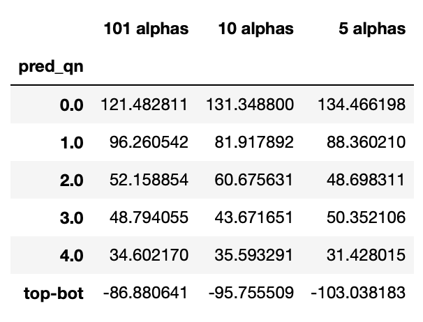
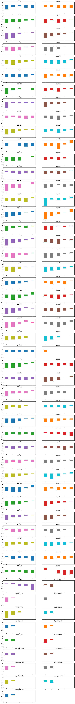

# 101-Formulaic-Alphas_AU
101 Formulaic Alphas with AU market

Target Stocks: Australia
1st Period: 1, January, 2010 - 1, January, 2015
2nd Period: 1, January, 2019 - 1, January, 2021

************************************************************************************

This is our second attempt to test the performance of the alpha factors based on this paper, "101 Formulaic Alphas". The method is as follows.

Step 1: Read in and clean the price data of the stocks in the Philippine market. Then, all the values of 101 alpha factors are calculated.

Step 2: Choose period that we are interested in, which are (i) 01/01/2010 - 01/01/2015; (ii) 01/01/2019 - 01/01/2021.

Step 3: Check the quantile analysis for these two period. The figures are as shown at the end of this note.

Step 4: Use SHAP method to evaluate the feature importance. Train (70%) and test (30%) the data by using xgboost package with all 101, top 10, and top 5 features.

Results:
1. The quantile analysis shows that the 101 alpha factors had great predictive capability before 2015. However, the prediction is almost eliminate after the publication of the reference paper (2019-2021).
2. xgboost modellings show a even worse output: the mean return from the top quantile is smaller than the bottom one, which presents a negative result at this system / alpha factors.

Period: 2010-2015
Label: return-1d (unit is the base point, 1E-4)

Period: 2010-2015
Label: return-4d (unit is the base point, 1E-4)

Period: 2019-2021
Label: return-4d (unit is the base point, 1E-4)

Period: 2019-2021
Label: return-4d (unit is the base point, 1E-4)

Quantile analysis with return-1d (2010-2015)

Quantile analysis with return-1d (2019-2021)

Quantile analysis with return-1d (2010-2015)

Quantile analysis with return-4d (2019-2021)

